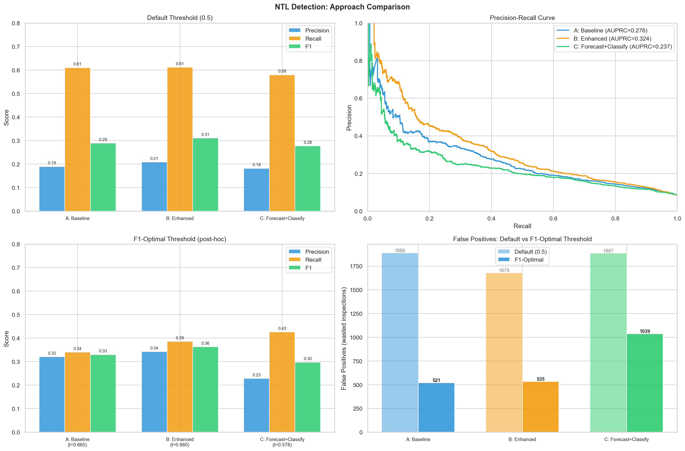

# Non-Technical Loss Detection with Chronos-2 and XGBoost

Detect electricity theft by combining **zero-shot time-series forecasting** (Chronos-2) with **gradient-boosted classification** (XGBoost) on Amazon SageMaker.



## Problem

Utility companies detect Non-Technical Losses (NTL) — meter bypass, tampering, illegal connections — using classifiers on raw consumption data. These classifiers produce high false positive rates because they can't distinguish seasonal or legitimate consumption spikes from actual theft. Each false positive triggers a wasted field inspection — expensive and damaging to customer trust.

## Approach

Three approaches on the same dataset, same train/test split, same XGBoost classifier — only the **input features** change:

| Notebook | Approach | Features | Hypothesis |
|----------|----------|----------|------------|
| `01-baseline` | Baseline Classifier | Raw consumption stats (mean, std, skew, etc.) | Current state — catches theft but many false positives |
| `02-enhanced` | Enhanced Classifier | Baseline + temporal patterns, periodicity, trend | Better features = fewer false positives |
| `03-forecast-classify` | Forecast + Classify | Chronos-2 forecast residuals (actual - predicted) | Remove seasonal noise first, then classify on anomalies |
| `04-comparison` | Head-to-head | Loads results from A/B/C | Side-by-side metrics, PR curves, operational impact |

The key insight behind Approach C: *"Your classifier tries to find a needle in a haystack. We remove the hay first."*

## Dataset

**SGCC** (State Grid Corporation of China) — public dataset from Kaggle:
- 42,372 customers, 1,035 days of daily consumption
- Binary labels: 0 = normal, 1 = confirmed theft (verified by on-site inspection)
- ~8% theft rate

Requires Kaggle credentials (`~/.kaggle/kaggle.json`).

## Infrastructure

```
Local (IDE only)              Amazon SageMaker AI
─────────────────             ──────────────────────────────
Data download (Kaggle)   ──>  XGBoost training (ModelTrainer, SDK v3)
Feature engineering      ──>  Chronos-2 inference (custom endpoint)
Evaluation & plots
```

- No GPU required locally — all compute happens on SageMaker
- XGBoost trains on `ml.m5.large` (~3 min per job)
- Chronos-2 serves on `ml.g5.2xlarge` (custom real-time endpoint)

## Setup

```bash
# 1. Create and activate virtual environment
python -m venv .venv
source .venv/bin/activate
pip install -r requirements.txt  # TODO: add top-level requirements.txt

# 2. Set your SageMaker execution role (or it will auto-detect from your session)
export SAGEMAKER_EXECUTION_ROLE="arn:aws:iam::YOUR_ACCOUNT:role/YOUR_ROLE"

# 3. Run Approaches A and B (no dependencies between them)
jupyter nbconvert --execute 01-baseline.ipynb --to notebook
jupyter nbconvert --execute 02-enhanced.ipynb --to notebook

# 4. Deploy Chronos-2 endpoint, then run Approach C
python chronos-endpoint/deploy.py
jupyter nbconvert --execute 03-forecast-classify.ipynb --to notebook

# 5. Run comparison (works with whatever results exist)
jupyter nbconvert --execute 04-comparison.ipynb --to notebook

# 6. Clean up endpoint when done
python chronos-endpoint/deploy.py --delete
```

## File Structure

```
├── README.md
├── utils.py                              # Shared module
├── 01-baseline.ipynb                     # Approach A — run first
├── 02-enhanced.ipynb                     # Approach B — run first
├── 03-forecast-classify.ipynb            # Approach C — needs Chronos-2 endpoint
├── 04-comparison.ipynb                   # Run after approach notebooks
├── chronos-endpoint/
│   ├── deploy.py                         # Deploy / test / delete endpoint
│   ├── inference.py                      # Custom inference handler
│   └── requirements.txt
├── training/
│   ├── train.py                          # XGBoost script (runs inside SageMaker)
│   └── requirements.txt
└── results/                              # Auto-populated by each notebook (gitignored)
```

## Key Technical Decisions

- **Chronos-2 on SageMaker endpoint** (not local) — GPU-accelerated, scalable to millions of meters
- **Zero-shot forecasting** — Chronos-2 needs no training, no fine-tuning, no per-meter fitting
- **SageMaker SDK v3** — `ModelTrainer` pattern for all XGBoost training jobs
- **Shared `utils.py`** — notebooks are independent but share data loading, feature engineering, and SageMaker helpers
