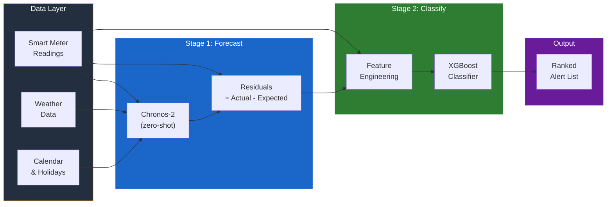

# Electricity Theft Detection on SageMaker: A Feature Engineering Comparison

You can read a blog post about this implementation on [Medium](https://dgallitelli95.medium.com/stop-chasing-false-positives-how-time-series-forecasting-can-fix-electricity-theft-detection-ccb96c245183)!

> **Disclaimer:** This is a hands-on tutorial comparing three feature engineering strategies for Non-Technical Loss (NTL) detection. It is **not** a state-of-the-art benchmark — it uses a minimal pipeline to isolate the effect of input features on classification performance. See [published results on SGCC](#context-published-results-on-sgcc) for context.



## Problem

Utility companies detect Non-Technical Losses (NTL) — meter bypass, tampering, illegal connections — using classifiers on raw consumption data. These classifiers produce high false positive rates because they can't distinguish seasonal or legitimate consumption spikes from actual theft. Each false positive triggers a wasted field inspection — expensive and damaging to customer trust.

## Approach

Three approaches on the same dataset, same train/test split, same XGBoost classifier — only the **input features** change:

| Notebook | Approach | Features | Hypothesis |
|----------|----------|----------|------------|
| `01-baseline` | Baseline Classifier | Raw consumption stats (mean, std, skew, etc.) | Current state — catches theft but many false positives |
| `02-enhanced` | Enhanced Classifier | Baseline + temporal patterns, periodicity, trend | Better features = fewer false positives |
| `03-forecast-classify` | Forecast + Classify | Chronos-2 forecast residuals (actual - predicted) | Remove seasonal noise first, then classify on anomalies |
| `04-comparison` | Head-to-head | Loads results from A/B/C | Side-by-side metrics, PR curves, operational impact |

The key insight behind Approach C: *"Your classifier tries to find a needle in a haystack. We remove the hay first."*

## Dataset & Results

To test these three approaches under controlled conditions, we use the **SGCC** (State Grid Corporation of China) public dataset from Kaggle — a widely used benchmark for NTL research:

- 42,372 customers, 1,035 days of daily consumption
- Binary labels: 0 = normal, 1 = confirmed theft (verified by on-site inspection)
- ~8% theft rate

### Results at F1-optimal threshold


| Metric | A: Baseline (t=0.665) | **B: Enhanced (t=0.660)** | C: Forecast+Classify (t=0.578) |
|--------|----------------------|--------------------------|-------------------------------|
| Precision | 32.1% | **34.3%** | 22.9% |
| Recall | 33.4% | **36.3%** | 43.0% |
| F1 | 33.0% | **36.3%** | 29.8% |
| AUC | 0.758 | **0.778** | 0.735 |
| False Positives | 521 | **535** | 1,039 |

**B wins on this dataset.** SGCC has clean, daily consumption patterns where statistical features capture the signal well. Approach C underperforms here precisely because SGCC lacks the conditions where forecasting shines — strong seasonality, weather effects, and concept drift. On real-world data with higher granularity (hourly/15-min), real weather, and evolving consumption patterns, the forecast layer removes noise that statistical features cannot, and Approach C's advantage grows.

### Context: published results on SGCC

Published benchmarks on this dataset report significantly higher metrics than ours:

| Source | Model | Precision | F1 | AUC |
|--------|-------|-----------|-----|-----|
| [Khan et al. 2020](https://doi.org/10.3390/su12198023) | VGG-16 + FA-XGBoost + Adasyn | 93.0% | 93.7% | 0.959 |
| [Madbouly et al. 2025](https://doi.org/10.56979/801/2024) | CNN-XGB hybrid | 90.6% | 91.2% | 0.93 |
| [Khan et al. 2020](https://doi.org/10.3390/su12198023) | XGBoost (no oversampling) | 60.0% | 59.0% | 0.632 |
| **Ours (B: Enhanced)** | **XGBoost** | **34.3%** | **36.3%** | **0.778** |

The gap is real. Published approaches use more sophisticated pipelines: synthetic oversampling (SMOTE/Adasyn), deep feature extraction (VGG-16, CNN), advanced hyperparameter optimization (Firefly algorithm), and different evaluation protocols.

**This repo is not a SOTA attempt.** It's a teaching demo that compares three feature engineering strategies — raw statistics, enhanced temporal features, and forecast residuals — on the same minimal pipeline. The value is the methodology comparison, not absolute numbers.

## Infrastructure

```
Local (IDE only)              Amazon SageMaker AI
─────────────────             ──────────────────────────────
Data download (Kaggle)   ──>  XGBoost training (ModelTrainer, SDK v3)
Feature engineering      ──>  Chronos-2 inference (custom endpoint)
Evaluation & plots
```

- No GPU required locally — all compute happens on SageMaker
- XGBoost trains on `ml.m5.large` (~3 min per job)
- Chronos-2 serves on `ml.g5.2xlarge` (custom real-time endpoint)

## Setup

```bash
# 1. Create and activate virtual environment
python -m venv .venv
source .venv/bin/activate
pip install -r requirements.txt

# 2. Set your SageMaker execution role (or it will auto-detect from your session)
export SAGEMAKER_EXECUTION_ROLE="arn:aws:iam::YOUR_ACCOUNT:role/YOUR_ROLE"

# 3. Run Approaches A and B (no dependencies between them)
jupyter nbconvert --execute 01-baseline.ipynb --to notebook
jupyter nbconvert --execute 02-enhanced.ipynb --to notebook

# 4. Deploy Chronos-2 endpoint, then run Approach C
python chronos-endpoint/deploy.py
jupyter nbconvert --execute 03-forecast-classify.ipynb --to notebook

# 5. Run comparison (works with whatever results exist)
jupyter nbconvert --execute 04-comparison.ipynb --to notebook

# 6. Clean up endpoint when done
python chronos-endpoint/deploy.py --delete
```

## File Structure

```
├── README.md
├── utils.py                              # Shared module
├── 01-baseline.ipynb                     # Approach A — run first
├── 02-enhanced.ipynb                     # Approach B — run first
├── 03-forecast-classify.ipynb            # Approach C — needs Chronos-2 endpoint
├── 04-comparison.ipynb                   # Run after approach notebooks
├── chronos-endpoint/
│   ├── deploy.py                         # Deploy / test / delete endpoint
│   ├── inference.py                      # Custom inference handler
│   └── requirements.txt
├── training/
│   ├── train.py                          # XGBoost script (runs inside SageMaker)
│   └── requirements.txt
└── results/                              # Auto-populated by each notebook (gitignored)
```

## Key Technical Decisions

- **Chronos-2 on SageMaker endpoint** (not local) — GPU-accelerated, scalable to millions of meters
- **Zero-shot forecasting** — Chronos-2 needs no training, no fine-tuning, no per-meter fitting
- **SageMaker SDK v3** — `ModelTrainer` pattern for all XGBoost training jobs
- **Shared `utils.py`** — notebooks are independent but share data loading, feature engineering, and SageMaker helpers
